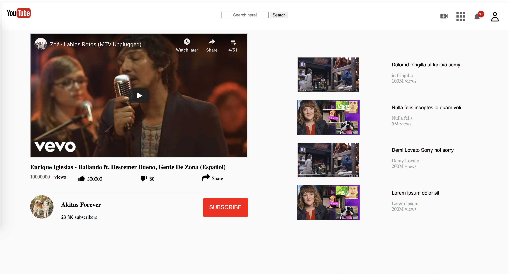

# Embedding Images And Video

> This is the clone YouTube’s video player page. Prepared for as a collaboration project with my coding partner Rocio from Microverse. 
This project's name is "Embedding Images and Video" in Microverse.

## Built With

- HTML and CSS
- without any extra css library

## Live Demo

[Live Demo Link](https://bit.ly/2Xt3XCg)

## Authors

👤 **Ramin Mammadzada**

- Github: [@githubhandle](https://github.com/raminmammadzada)
- Twitter: [@twitterhandle](https://twitter.com/raminmammadzada)
- Linkedin: [linkedin](https://linkedin.com/raminmammadzada)

👤 **Zulma Rocio**

- Github: [@githubhandle](https://github.com/Rocio01)
- Twitter: [@twitterhandle](https://twitter.com/rugiada8801)
- Linkedin: [linkedin](https://linkedin.com/linkedinhandle)

## 🤝 Contributing

Contributions, issues and feature requests are welcome!

Feel free to check the [issues page](issues/).

## Show your support

Give a ⭐️ if you like this project!

## 📝 License

This project is [MIT](lic.url) licensed.